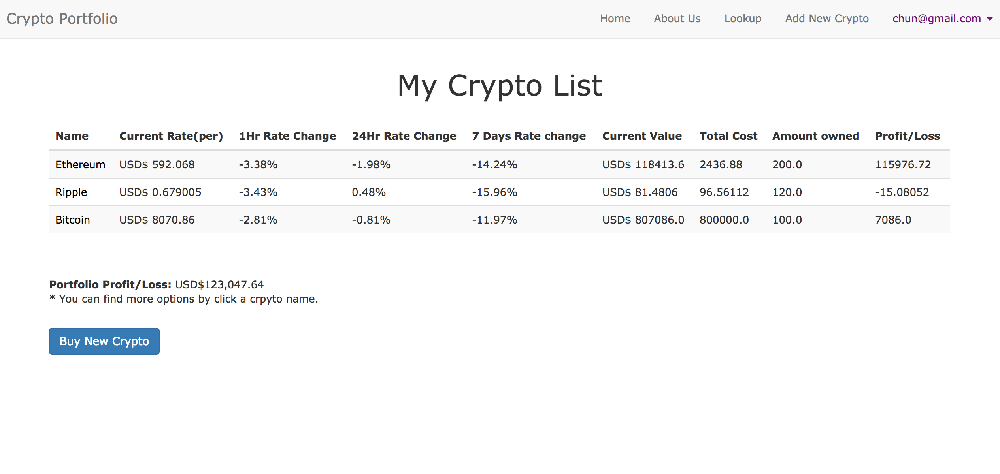
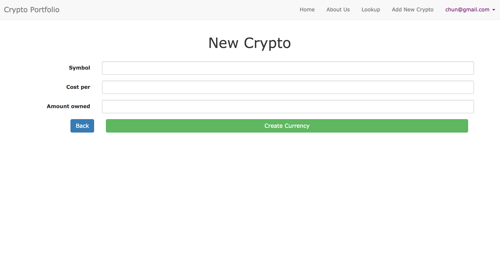

# Crypto Portfolio App

A Ruby on Rails App help user to manage their crypto portfolio. User can check current price of crypto currencies and also their profit/loss.

## ScreenShot



* You can setup your own crypto portfolio for you to track!

## Getting Started

These instructions will get you a copy of the project up and running on your local machine for development and testing purposes. See deployment for notes on how to deploy the project on a live system.

### Prerequisites

Be able to install the use the app you have to install ruby and rails.

```
Check your Ruby version: ruby -v
Install rails: sudo gem install rails
Check your Rails version: rails --version
```

### Setup

1. Fork & Clone
2. Run bundle install to install dependencies
3. Run bin/rake db:reset to create, load and seed db
4. Run bin/rails server to start the server
5. Open Browser to localhost:3000
 
## Author

* **Chun Yang**

## Acknowledgments

* This Project use API from www.coinmarketcap.com
* There are few more features I am planning to add in the future.
  * User can Add their desired crypto currencies to their portfolio in lookup page.
  * User can sorted crypto currencies in many ways.
  * Provide User graph to show crypto price recent changes.
* I use the Bootstrap v3.3.7 in this project and I will continue update the styling to make it more user friendly.


